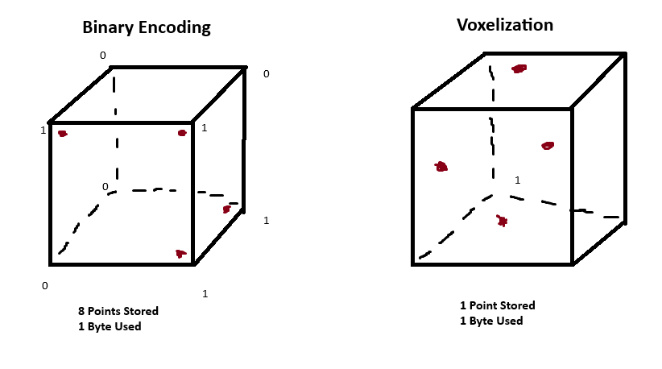

# binary-pointclouds

## Abstract
3D Deep Learning techniques suffer from a variety of computational restraints, primarily resulting from the representation of the data necessary to train a robust model. In order to train models efficiently, methods must be implemented to ensure data does not bloat the model, while maintaining a significant structural similarity to the target after manipulating the data. Existing methods utilize down-sampling techniques to reduce 3D model sizes, but still prove to be too large even after significant compression. Our approach leverages inherent properties in point clouds to maximize the compression of point clouds in a truly binary method, maintains significant structural similarity, and has potential to increase training speeds during deep learning tasks.

## Introduction
All documentation here is a work-in-progress, as this GitHub is a work-in-progress.

This GitHub repo intends to find a method of efficiently encoding and decoding a 3D Point Cloud into a binary format in order to achieve higher levels of compression and faster speeds for reading and writing. Existing techniques are already quite effective at doing this, but to my awareness none of them currently leverage my favorite theory of probability - everything is 50/50 always. It either happens or it doesn't. In our case, there's either a point there or there isn't. Utilizing this absolutely true and highly scientific theory, we intend on fitting a point cloud into a position that can leverage this coin flip property for a hypothetically more efficient way of storing, reading, and writing of point clouds.

## Approach
Our driving theory follows a 6 step approach:

1.) Normalize
  * We normalize the initial point cloud to a unit cube.

2.) Define Bounding Box
  * Since the point cloud is centered at an origin, we find the furthest points from (0, 0, 0) in all three axis. We then create a bounding box that encompasses the entirety of the point cloud.

3.) Subdivide
  * As the box is rectangular, we can essentially "cubify" the box evenly. Choosing a higher number of slices will increase the resolution of the point cloud, but also increases the total run-time and storage. 

4.) Fit
  * We now run a fitting algorithm on the point cloud. Each point is set to the nearest intersection, so long as it is within a pre-defined distance from any intersection. If there is already a point in the closest intersection or if the point is not near enough to any intersection, then the point is ignored.

5.) Binary
  * At every intersection, determine if a point has been moved there. If there is a point, then we set a 1 for that position in the final data structure for the binary point cloud. If there is not a point, that index gets a 0.

6.) Encode
  * We now create a bit-array, encoded with only 26 bytes of necessary header information, as well as encoding the bit array with a Run-Length Encoding algorithm.

With higher number of slices, the voxelization technique outperforms the binary technique at every metric with the tests we've performed so far. The binary technique's highest and best stable number of slices is 64 for each axis.

I am now currently working on ways to further condense the binary vectors, and am beginning to work on a method to implement the binary vector directly in Machine Learning pipelines.

Here's a rough graphic that sort of shows a bit of what we're trying to do:

### Implementation One
Our initial method (implementation_one.py) does not strictly follow this theory, but serves as a decent starting example to show that this could work the way we intend. We are currently testing with objects for ModelNet40. We've found with our initial implementation that at lower slices we achieve a smaller point cloud in terms of storage space than the current Open3D Voxelization method with the same number of points. The speed with these lower slices is comparable to the voxelization method. The visual appearance of the point cloud is of similar quality, albeit the voxelization technique could be fine-tuned to do better with the same number of points in terms of visual quality. However, as we are focused on eventually sending these point clouds to perform Deep Learning tasks, the initial appearance of the quality of both point clouds intuitively seem as if they would perform well. We will perform qualatative tests in the future.

### Implementation Two
Implementation Two follows the approach from above. For each intersection in the bounding box, we determine if a point is within a certain threshold. If so, that intersection is marked with a 1, and if not, the intersection is marked with a 0. We then store this binary vector as a bitarray, which has a compression effect of (number of slices^3) / 8. With 64 slices per axis, we will always achieve a storage size of 32KB. I am looking into methods to further compress this. 

We determine if a point is within a radius by using a pre-determined K-D Tree Algorithm provided by Open3D. This significantly cuts down on computation for each intersection - with 64 slices per axis, we can turn a point cloud into a binary encoding in under a second. With 128 slices per axis, it only takes three seconds.

We also find that with our current test target of the sofa, assuming the point clouds have the same number of points, with 128 slices per axis the binary method stores slightly more compact than the voxelization method. However, the binary method appears to be more cluttered than the voxelization method, although this may not necessarily be an issue as it is a closer representation of the input point cloud's appearance than if it were more spaced out.

### Implementation Three
We utilize the exact same process from Implementation Two, but add an aditional encoding step. We perform RLE on the bitarray, allowing us to compress the sequential runs of 1s and 0s into even smaller representations. This significantly helps reduce the bloat from the empty space of the point cloud. I go into further detail in the Experiments section "RLE Test." This is our current best method of compressing data. 

## Experiments

A full description of the Experiments ran can be found [here.](assets/docs/experiments.md)

## Results

### Storage Tests

In these tests, we compare our technique against other downsampling techniques to see which one stores data more compact. More information the experiments can be found in the Experiments section.

#### Storage Test 1: Base Case

| Dataset  | Total Size (KB) | Average Size (KB) | Objects larger than binary | Objects smaller than binary | Objects equal to binary |
|----------|-----------------|-------------------|----------------------------|----------------------------|-------------------------|
| Slice64  |    393952KB     |        32KB       |           N/A              |             N/A            |           N/A           |
| Voxel64  |    272184KB     |        22KB       |          2398              |            9913            |            0            |
| Slice128 |   3151616KB     |       256KB       |           N/A              |             N/A            |           N/A           |
| Voxel128 |    395505KB     |        32KB       |           151              |           12160            |            0            |

In our Base Case study, we compare our Binary Encoding technique against Open3D's Voxelization Technique + a Density-Aware Downsampling method. The Density-Aware Downsampling method was only used if the total number of points in the Voxelized point cloud was higher than the total number of points the Binary Encoded point cloud, in order to keep things fair.

In this test, we find that Voxelization rather handily beats our method at 64 slices, and overwhelmingly beats our method at 128 slices. I initially thought we would perform much worse than voxelization at this point, but was surprised to see just how much worse this method was compared to voxelization.

Although we store 8 points for the price of 1 byte, we also store every single empty space as a point in our bitarray. Voxelization stores every active point more expensively than we do, but does not store the empty space. Our base method can be expected to beat Voxelization when our method is used with lower resolution on large point clouds.

Furthermore, although this is the storage test, it is worth noting that Voxelization performs significantly faster than our Binary Encoding technique. The higher the slice resolution, the longer it takes for a point cloud to be encoded. Although we have significantly decreased the length of time it takes for the binary encoding to finish, the 128 resolution still takes on average just under three seconds to finish, whereas the voxelization takes less than a tenth of a second. However, we find that this length of time is not necessarily a deterrent from using our method in cases where it makes sense to use, as this is a pre-processing step, and the decoding time is exponentially faster than the encoding time.

#### Storage Test 2: RLE Test 1

| Dataset  | Total Size (KB) | Average Size (KB) | Objects larger than binary | Objects smaller than binary | Objects equal to binary |
|----------|-----------------|-------------------|----------------------------|----------------------------|-------------------------|
| Slice64  |     53058KB     |       4.3KB       |           N/A              |             N/A            |           N/A           |
| Voxel64  |    272184KB     |        22KB       |          12081             |             229            |            1            |
| Slice128 |    139476KB     |      11.3KB       |           N/A              |             N/A            |           N/A           |
| Voxel128 |    395505KB     |        32KB       |          11631             |             679            |            1            |

In our Run Length Encoding (RLE) study, we compare our Binary Encoding technique against Open3D's Voxelization Technique + a Density-Aware Downsampling method. The Density-Aware Downsampling method was only used if the total number of points in the Voxelized point cloud was higher than the total number of points the Binary Encoded point cloud, in order to keep things fair. It is important to mention that we did not re-run the Voxelization test for this study, as there was no change to the encoding process that made it necessary to re-run the Voxelization datasets.

In short, our RLE method further compresses the bitarray by representing the length of a sequence as a binary number. Until further literature review is finished, I am calling our method of RLE "Dynamic Binary RLE." Dynamic, because the bit-string length is not a static number for each object being stored, and Binary because it's all 1s and 0s. I go into further detail in the corresponding Experiments section.

In this test, we find that our method beats the Voxelization method in a vast majority of cases. As of right now, it seems the only times Voxelization stores more compact is when point clouds are so small they hardly need to be down-sampled to begin with (such as point clouds with only 100 points or less). We will need to sample more of the cases where Voxelization wins to make this a blanket statement.

Our method finds exponential gains in compression when point clouds are large. This is because we can better utilize the method of storing 8 points in 1 byte of memory than previously, as we have significantly reduced the amount of storage space the empty space of the point cloud takes. In that same vein, we still find sufficiently performed compression when we compare the small and medium sized point clouds.

I will once again state that Voxelization performs significantly faster than our Binary Encoding technique. However, adding this extra encoding step does dramatically further increase the time it takes to perform our technique. On average, for Slice64, we only added an additional 0.01-0.05 seconds, and for Slice128, we only added an additional 0.05-0.1 seconds. As for decoding speeds, the Binary Encoding technique still decodes extremely fast (I am assuming less than 0.1 seconds, but I have not done a rigourous speed test on the decoding aspect yet).

Our implementation of RLE seems to be what we're looking for to enable our Binary Encoding Technique to be an extremely efficient method of compressing point cloud data. Our future tests will involve analyzing the structural integrity of the point cloud post-downsampling, and performing AI/ML tasks on the data.

#### Storage Test 2: RLE Test 2

In round 2 of testing, we re-run both the binary point cloud encoding portion and the voxelization portion, as we have changed the style of the heading and the method of encoding. The change to the encoding reflects a fix to how points were being placed and measured, and the change to the heading reflects the need to keep only necessary information in the stored binary file.

| Dataset  | Total Size (KB) | Average Size (KB) | Objects larger than binary | Objects smaller than binary | Objects equal to binary |
|----------|-----------------|-------------------|----------------------------|----------------------------|-------------------------|
| Slice64  |     56602KB     |       4.6KB       |           N/A              |             N/A            |           N/A           |
| Voxel64  |    280371KB     |        22KB       |          12003             |             308            |            0            |
| Slice128 |    144555KB     |      11.7KB       |           N/A              |             N/A            |           N/A           |
| Voxel128 |    400118KB     |        32KB       |          11481             |             828            |            2            |

Even with this change, our technique is still, on average, superior. In this situation where we have added a substantial number of points per point cloud, there is not a proportial substantial increase in point clouds where voxelization is better than our technique.

## References