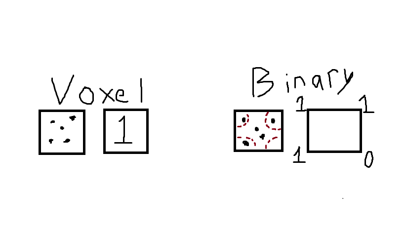

# binary-pointclouds

## Introduction
All documentation here is a work-in-progress, as this GitHub is a work-in-progress.

This GitHub repo intends to find a method of efficiently encoding and decoding a 3D Point Cloud into a binary format in order to achieve higher levels of compression and faster speeds for reading and writing. Existing techniques are already quite effective at doing this, but to my awareness none of them currently leverage my favorite theory of probability - everything is 50/50 always. It either happens or it doesn't. In our case, there's either a point there or there isn't. Utilizing this absolutely true and highly scientific theory, we intend on fitting a point cloud into a position that can leverage this coin flip property for a hypothetically more efficient way of storing, reading, and writing of point clouds.

## Approach
Our driving theory follows a 5 step approach:

1.) Normalize
  * We normalize the initial point cloud

2.) Define Bounding Box
  * Since the point cloud is centered at an origin, we find the furthest points from (0, 0, 0) in all three axis. We then create a bounding box that encompasses the entirety of the point cloud.

3.) Subdivide
  * As the box is rectangular, we can essentially "cubify" the box evenly. 

4.) Fit
  * We now run a fitting algorithm on the point cloud. Each point is set to the nearest intersection, so long as it is within a pre-defined distance from any intersection. If there is already a point in the closest intersection or if the point is not near enough to any intersection, then the point is ignored.

5.) Binary
  * At every intersection, determine if a point has been moved there. If there is a point, then we set a 1 for that position in the final data structure for the binary point cloud. If there is not a point, that index gets a 0.

With higher number of slices, the voxelization technique outperforms the binary technique at every metric with the tests we've performed so far. The binary technique's highest and best stable number of slices is 64 for each axis.

I am now currently working on ways to further condense the binary vectors, and am beginning to work on a method to implement the binary vector directly in Machine Learning pipelines.

Here is an extremely detailed and awesome graphic that explains how my method differs from voxelization from a 2D perspective:

### Implementation One
Our initial method (implementation_one.py) does not strictly follow this theory, but serves as a decent starting example to show that this could work the way we intend. We are currently testing with objects for ModelNet40. We've found with our initial implementation that at lower slices we achieve a smaller point cloud in terms of storage space than the current Open3D Voxelization method with the same number of points. The speed with these lower slices is comparable to the voxelization method. The visual appearance of the point cloud is of similar quality, albeit the voxelization technique could be fine-tuned to do better with the same number of points in terms of visual quality. However, as we are focused on eventually sending these point clouds to perform Deep Learning tasks, the initial appearance of the quality of both point clouds intuitively seem as if they would perform well. We will perform qualatative tests in the future.

### Implementation Two
Implementation Two follows the approach from above. For each intersection in the bounding box, we determine if a point is within a certain threshold. If so, that intersection is marked with a 1, and if not, the intersection is marked with a 0. We then store this binary vector as a bitarray, which has a compression effect of (number of slices^3) / 8. With 64 slices per axis, we will always achieve a storage size of 32KB. I am looking into methods to further compress this. 

We determine if a point is within a radius by using a pre-determined K-D Tree Algorithm provided by Open3D. This significantly cuts down on computation for each intersection - with 64 slices per axis, we can turn a point cloud into a binary encoding in under a second. With 128 slices per axis, it only takes three seconds.

We also find that with our current test target of the sofa, assuming the point clouds have the same number of points, with 128 slices per axis the binary method stores slightly more compact than the voxelization method. However, the binary method appears to be more cluttered than the voxelization method, although this may not necessarily be an issue as it is a closer representation of the input point cloud's appearance than if it were more spaced out.

## Experiments

### Storage Size Comparison Against Open3D Voxelization Technique

For this test, we converted the entirety of ModelNet40 into four separate downsampled point cloud versions. Two of these datasets were made with the technique in Implementation Two, and the other two datasets were made using Open3D's Voxelization technique. The following table shows the results in the Size Comparison test, with notes below:

| Dataset  | Total Size (KB) | Average Size (KB) | Objects larger than binary | Objects smaller than binary | Objects equal to binary |
|----------|-----------------|-------------------|----------------------------|----------------------------|-------------------------|
| Slice64  |                 |        32KB       |           N/A              |             N/A            |           N/A           |
| Voxel64  |                 |                   |                            |                            |                         |
| Slice128 |                 |       256KB       |           N/A              |             N/A            |           N/A           |
| Voxel128 |                 |                   |                            |                            |                         |

**Slice64** and **Slice128** are the datasets created by the binary technique. We differentiate between the two with their relevant number by how many slices there are on each axis. With the current technique, we are storing the data as one long bitarray with no extra compression. This means that each point is equivalent to 1 bit of space, and each point cloud is storing every single possible point in the point cloud as a 1 or a 0. Therefore, each object has the same storage size in their respective data sets. **Slice64** has 32KB for every point cloud, and **Slice128** has 256KB for every point cloud.

**Voxel64** and **Voxel128** are the datasets created using Open3D's Voxelization technique. Some miscallaneous notes about the way this is implemented:
* Each point cloud was downsampled with the open3d.geometry.voxel_down_sample() function, and the voxel size was set to 0.001 for each point cloud. The number is this low because we normalized each point cloud prior to downsampling. 
* To make things fair, I decided to also apply a density aware downsampling technique to the voxelization technique when the overall points of the point cloud after voxelization was higher than the number of 1s in the corresponding binary point cloud. The density aware downsampling ensures that no voxelized point cloud has more points than its binary point cloud counterpart. This technique was not applied to any point clouds with equal or lower number of points than the binary point cloud counterpart. I believe this makes the comparison fair, as I find that density aware downsampling is an easy to implement addition to voxelization when you're trying to perform data preprocessing, and most Deep Learning tasks find their job easier when the number of points is homogenous across the entire dataset. I did not pad points when the total points were lower, as this is ultimately a test of which technique stores in a more compact form.
* The threshold for "larger / smaller / equal to" is based on the storage size of the binary. So for **Voxel64**, the threshold is 32KB, and for **Voxel128**, the threshold is 256KB.

The rough average speed for an operation on the data sets were as follows:
**Slice64:** ~0.3-0.4 seconds
**Slice128:** ~2.6-2.8 seconds
**Voxel64:** less than 0.1 seconds
**Voxel128:** less than 0.1 seconds

## Results

## References